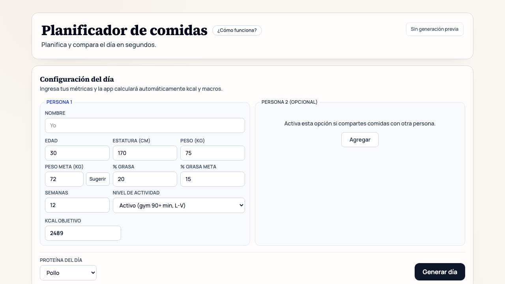

# Companion App

Companion App es una herramienta para planear tus comidas del dia de forma simple, clara y rapida. Te ayuda a convertir un objetivo fisico en decisiones concretas de alimentacion, sin complicarte con calculos manuales.

## Captura de pantalla

## Que resuelve

Cuando intentas comer con intencion (bajar grasa, mantenerte o recomponer), lo mas dificil suele ser mantener consistencia diaria. Companion App te da una estructura practica para organizar tus comidas y ajustar porciones con rapidez.

## Lo que puedes hacer

- Planear un dia completo de comidas segun tu objetivo.
- Trabajar con 1 o 2 personas en paralelo.
- Ajustar porciones y regenerar opciones sin empezar desde cero.
- Ver tu progreso diario de calorias y proteina de manera clara.
- Retomar tu ultimo plan cuando vuelvas a abrir la app.

## Como se usa

1. Completa tus datos y define tu objetivo.
2. Genera el plan del dia.
3. Ajusta comidas o ingredientes segun tu contexto real.
4. Marca lo que ya hiciste y revisa tu avance diario.

## Para quien es

- Personas que quieren comer mejor sin friccion.
- Quienes prefieren una guia practica en lugar de planes rigidos.
- Parejas o roommates que comparten comidas con metas distintas.

## Nota

Companion App es una herramienta de apoyo y no reemplaza la asesoria de un profesional de nutricion o medicina.
